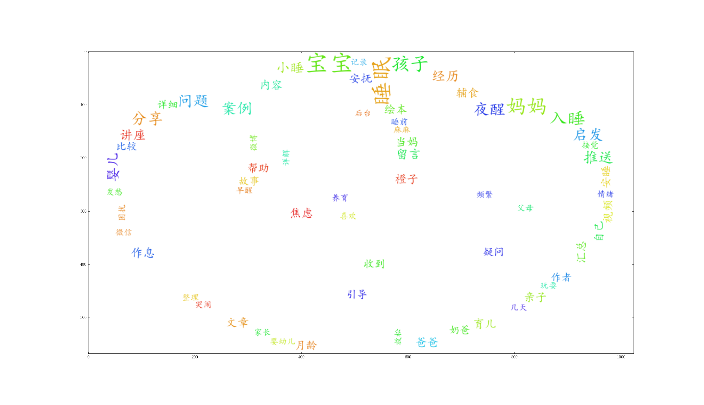

## matplotlib 中文乱码处理

python 强大的作图工具matplotlib在显示中文时会出现乱码，可以通过配置系统设置来解决，具体解决方式如下：

```

import matplotlib.pyplot as plt

#处理中文问题
from pylab import mpl
mpl.rcParams['font.sans-serif'] = ['FangSong'] # 指定默认字体
mpl.rcParams['axes.unicode_minus'] = False # 解决保存图像是负号'-'显示为方块的问题
%matplotlib

```
经过上述处理，可正常展示中文。

## wordcloud 中文展示

词云绘制工具wordcloud经常用来进行人物画像，对于中文来说，需要配置以下字体路径，如下：

```
import wordcloud

def cloud(fre):
    wc = wordcloud.WordCloud(font_path='C:\Windows\Fonts\simkai.ttf',background_color="white", max_words=2000, max_font_size=80, random_state=42,mask=heart)
    wc.generate_from_frequencies(fre)
    plt.imshow(wc)
    plt.axis('off')

```

`wordcloud.WordCloud`中的`font_path`参数通过设置中文字体可以解决中文展示问题，展示样例如下：




