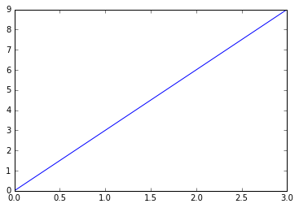
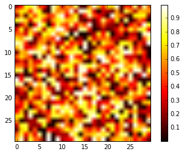
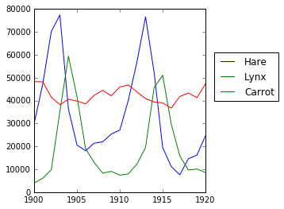
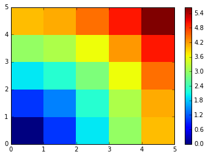
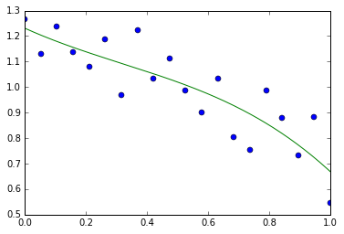
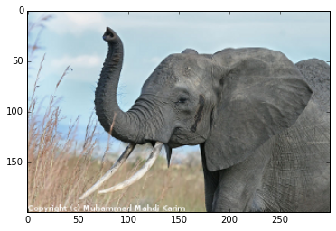
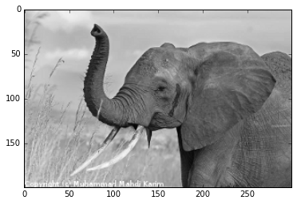

# NumPy 基础：数组和矢量计算


```python
import numpy as np
import pandas as pd
print 'hello world'
```

    hello world
    

## 创建ndarray


```python
data1 = [6,7.5,8,0,1]
arr1 = np.array(data1)
arr1
```


    array([ 6. ,  7.5,  8. ,  0. ,  1. ])


```python
data2 = [[1,2,3,4],[5,6,7,8]]
arr2 = np.array(data2)
arr2
```


    array([[1, 2, 3, 4],
           [5, 6, 7, 8]])


```python
arr2.ndim
```


    2


```python
arr2.shape
```


    (2L, 4L)


```python
arr2.dtype
```


    dtype('int32')


```python
np.zeros(10)
```


    array([ 0.,  0.,  0.,  0.,  0.,  0.,  0.,  0.,  0.,  0.])


```python
np.zeros((3,6))
```


    array([[ 0.,  0.,  0.,  0.,  0.,  0.],
           [ 0.,  0.,  0.,  0.,  0.,  0.],
           [ 0.,  0.,  0.,  0.,  0.,  0.]])


```python
np.ones((3,4))
```


    array([[ 1.,  1.,  1.,  1.],
           [ 1.,  1.,  1.,  1.],
           [ 1.,  1.,  1.,  1.]])


```python
np.empty((2,3,4))
```


    array([[[  1.82577335e-316,   8.73107750e-316,   1.81818490e-316,
               3.13307342e-316],
            [  2.08418905e-316,   8.73107987e-316,   1.81818490e-316,
               8.72472026e-316],
            [  2.08418905e-316,   8.73108224e-316,   1.81818490e-316,
               8.72315545e-316]],
    
           [[  2.08418905e-316,   8.73108462e-316,   1.81818490e-316,
               8.72802101e-316],
            [  2.08418905e-316,   8.73108699e-316,   1.81818490e-316,
               8.72462540e-316],
            [  2.08418905e-316,   8.72808228e-316,   1.81818490e-316,
               8.73047909e-316]]])


```python
np.arange(15)
```


    array([ 0,  1,  2,  3,  4,  5,  6,  7,  8,  9, 10, 11, 12, 13, 14])


```python
np.eye(10)
```


    array([[ 1.,  0.,  0.,  0.,  0.,  0.,  0.,  0.,  0.,  0.],
           [ 0.,  1.,  0.,  0.,  0.,  0.,  0.,  0.,  0.,  0.],
           [ 0.,  0.,  1.,  0.,  0.,  0.,  0.,  0.,  0.,  0.],
           [ 0.,  0.,  0.,  1.,  0.,  0.,  0.,  0.,  0.,  0.],
           [ 0.,  0.,  0.,  0.,  1.,  0.,  0.,  0.,  0.,  0.],
           [ 0.,  0.,  0.,  0.,  0.,  1.,  0.,  0.,  0.,  0.],
           [ 0.,  0.,  0.,  0.,  0.,  0.,  1.,  0.,  0.,  0.],
           [ 0.,  0.,  0.,  0.,  0.,  0.,  0.,  1.,  0.,  0.],
           [ 0.,  0.,  0.,  0.,  0.,  0.,  0.,  0.,  1.,  0.],
           [ 0.,  0.,  0.,  0.,  0.,  0.,  0.,  0.,  0.,  1.]])


```python
np.identity(10)
```


    array([[ 1.,  0.,  0.,  0.,  0.,  0.,  0.,  0.,  0.,  0.],
           [ 0.,  1.,  0.,  0.,  0.,  0.,  0.,  0.,  0.,  0.],
           [ 0.,  0.,  1.,  0.,  0.,  0.,  0.,  0.,  0.,  0.],
           [ 0.,  0.,  0.,  1.,  0.,  0.,  0.,  0.,  0.,  0.],
           [ 0.,  0.,  0.,  0.,  1.,  0.,  0.,  0.,  0.,  0.],
           [ 0.,  0.,  0.,  0.,  0.,  1.,  0.,  0.,  0.,  0.],
           [ 0.,  0.,  0.,  0.,  0.,  0.,  1.,  0.,  0.,  0.],
           [ 0.,  0.,  0.,  0.,  0.,  0.,  0.,  1.,  0.,  0.],
           [ 0.,  0.,  0.,  0.,  0.,  0.,  0.,  0.,  1.,  0.],
           [ 0.,  0.,  0.,  0.,  0.,  0.,  0.,  0.,  0.,  1.]])


```python
b = np.array([(1.5,2,3),(4,5,6)])
b
```


    array([[ 1.5,  2. ,  3. ],
           [ 4. ,  5. ,  6. ]])


```python
c = np.array([[1,2],[3,4]],dtype = complex)
c
```


    array([[ 1.+0.j,  2.+0.j],
           [ 3.+0.j,  4.+0.j]])


```python
a = np.arange(10)
print a
```

    [0 1 2 3 4 5 6 7 8 9]
    


```python
b = np.arange(12).reshape(4,3)
print b
```

    [[ 0  1  2]
     [ 3  4  5]
     [ 6  7  8]
     [ 9 10 11]]
    


```python
c = np.arange(24).reshape(2,3,4)
print c
```

    [[[ 0  1  2  3]
      [ 4  5  6  7]
      [ 8  9 10 11]]
    
     [[12 13 14 15]
      [16 17 18 19]
      [20 21 22 23]]]
    

## 数组类型


```python
arr = np.array([1,2,3,4,5])
arr.dtype
```


    dtype('int32')


```python
float_arr = arr.astype(np.float32)
arr.dtype
```


    dtype('int32')


```python
arr = np.array([3.7,-1.2,-2.6,0.5,12.9,10.1])
arr.dtype

```


    dtype('float64')


```python
arr.astype(np.int32)
```


    array([ 3, -1, -2,  0, 12, 10])


```python
numeric_strings = np.array(['1.25','-9.6','42'],dtype = np.string_)
numeric_strings.dtype

```


    dtype('S4')


```python
numeric_strings.astype(float)
```


    array([  1.25,  -9.6 ,  42.  ])


```python
arr = np.arange(10)
arr
```


    array([0, 1, 2, 3, 4, 5, 6, 7, 8, 9])


## 索引和切片


```python
arr[5]
```


    5


```python
arr[5:8]
```


    array([5, 6, 7])


```python
arr[5:8] =12
arr
```


    array([ 0,  1,  2,  3,  4, 12, 12, 12,  8,  9])


```python
arr_slice = arr[5:8]
arr_slice[1] = 12345
arr_slice
```


    array([   12, 12345,    12])


```python
arr
```


    array([    0,     1,     2,     3,     4,    12, 12345,    12,     8,     9])


```python
arr_slice[:] = 64
arr_slice
arr
```


    array([ 0,  1,  2,  3,  4, 64, 64, 64,  8,  9])


```python
a = np.arange(10)
a[::-1]
```


    array([9, 8, 7, 6, 5, 4, 3, 2, 1, 0])


```python
a[2:9:3]#[start:end:step]
```


    array([2, 5, 8])


## 基本运算


```python
a = np.array([20,30,40,50])
b = np.arange(4)
b
```


    array([0, 1, 2, 3])


c = a-b
c

NumPy中的乘法运算符 * 指示按元素计算，矩阵乘法可以使用 dot 函数或创建矩阵对象实现


```python
A = np.array([[1,1],[0,1]])
B = np.array([[2,0],[3,4]])
```


```python
A*B
```


    array([[2, 0],
           [0, 4]])


```python
np.dot(A,B)
```


    array([[5, 4],
           [3, 4]])


## 可视化


```python
import matplotlib.pyplot as plt
%matplotlib inline
```


```python
x = np.linspace(0,3,20)
y = np.linspace(0,9,20)
plt.plot(x,y)
plt.show()
```





```python
image = np.random.rand(30,30)
plt.imshow(image,cmap=plt.cm.hot)
plt.colorbar()
```


    <matplotlib.colorbar.Colorbar at 0xc31ccf8>





## Worked Example: data statistics


```python
data = np.loadtxt('C:\Users\zluck\Documents\Python\Python materials\scipy-lecture-notes-master\data\populations.txt')
```


```python
year,hares,lynxes,carrots = data.T
plt.axes([0.2,0.1,0.5,0.8])
plt.plot(year,hares,year,lynxes,year,carrots)
plt.legend(('Hare','Lynx','Carrot'),loc = (1.05,0.5))
```


    <matplotlib.legend.Legend at 0xd0c2b70>





```python
populations = data[:,1:]
populations.mean(axis=0)
```


    array([ 34080.95238095,  20166.66666667,  42400.        ])


```python
#Which species has the highest population each year
np.argmax(populations,axis=1)
```


    array([2, 2, 0, 0, 1, 1, 2, 2, 2, 2, 2, 2, 0, 0, 0, 1, 2, 2, 2, 2, 2], dtype=int64)


## Broadcasting

A lot of grid-based or network-based problems can also use broadcasting. For instance, if we want to compute the distance from the origin of points on a 10x10 grid, we can do


```python
x,y = np.arange(5),np.arange(5)[:,np.newaxis]
distance = np.sqrt(x**2+y**2)
distance
```


    array([[ 0.        ,  1.        ,  2.        ,  3.        ,  4.        ],
           [ 1.        ,  1.41421356,  2.23606798,  3.16227766,  4.12310563],
           [ 2.        ,  2.23606798,  2.82842712,  3.60555128,  4.47213595],
           [ 3.        ,  3.16227766,  3.60555128,  4.24264069,  5.        ],
           [ 4.        ,  4.12310563,  4.47213595,  5.        ,  5.65685425]])


```python
plt.pcolor(distance)
plt.colorbar()
```


    <matplotlib.colorbar.Colorbar at 0xd390cf8>





```python
x,y = np.ogrid[0:5,0:5]
x,y
```


    (array([[0],
            [1],
            [2],
            [3],
            [4]]), array([[0, 1, 2, 3, 4]]))


```python
x.shape,y.shape
```


    ((5L, 1L), (1L, 5L))


```python
distance = np.sqrt(x**2+y**2)
distance
```


    array([[ 0.        ,  1.        ,  2.        ,  3.        ,  4.        ],
           [ 1.        ,  1.41421356,  2.23606798,  3.16227766,  4.12310563],
           [ 2.        ,  2.23606798,  2.82842712,  3.60555128,  4.47213595],
           [ 3.        ,  3.16227766,  3.60555128,  4.24264069,  5.        ],
           [ 4.        ,  4.12310563,  4.47213595,  5.        ,  5.65685425]])


```python
x,y = np.mgrid[0:4,0:4]
x
```


    array([[0, 0, 0, 0],
           [1, 1, 1, 1],
           [2, 2, 2, 2],
           [3, 3, 3, 3]])


```python
y
```


    array([[0, 1, 2, 3],
           [0, 1, 2, 3],
           [0, 1, 2, 3],
           [0, 1, 2, 3]])


## Array shape manipulation

### Flattening


```python
a = np.array([[1,2,3],[4,5,6]])
a.ravel()
```


    array([1, 2, 3, 4, 5, 6])


```python
a.T
```


    array([[1, 4],
           [2, 5],
           [3, 6]])


```python
a.T.ravel()
```


    array([1, 4, 2, 5, 3, 6])


### Reshaping


```python
a.shape
```


    (2L, 3L)


```python
b = a.ravel()
b = b.reshape((2,3))
b
```


    array([[1, 2, 3],
           [4, 5, 6]])


```python
b[0,0] = 99
a
```


    array([[99,  2,  3],
           [ 4,  5,  6]])


```python
a = np.zeros((3,2))
b = a.T.reshape((3*2))
b
```


    array([ 0.,  0.,  0.,  0.,  0.,  0.])


```python
b[0]=9
a
```


    array([[ 0.,  0.],
           [ 0.,  0.],
           [ 0.,  0.]])


### Dimension shuffling


```python
a = np.arange(4*3*2).reshape(4,3,2)
a.shape
```


    (4L, 3L, 2L)


```python
a[0,2,1]
```


    5


```python
b = a.transpose(1,2,0)
b.shape
```


    (3L, 2L, 4L)


```python
b[2,1,0]
```


    5


```python
b[2,1,0] = -1
a[0,2,1]
```


    -1


## Sorting Data


```python
a = np.array([[4,3,5],[1,2,1]])
b = np.sort(a,axis = 1)
b
```


    array([[3, 4, 5],
           [1, 1, 2]])


```python
a.sort(axis = 1)
a
```


    array([[1, 1, 2],
           [3, 4, 5]])


```python
a = np.array([4,3,1,2])
j = np.argsort(a)
j
```


    array([2, 3, 1, 0], dtype=int64)


```python
a[j]
```


    array([1, 2, 3, 4])


```python
a.sort()
a
```


    array([1, 2, 3, 4])


```python
a = np.array([4,3,1,2])
j_max = np.argmax(a)
j_min = np.argmin(a)
j_max, j_min
```


    (0, 2)


```python
samples = np.zeros((6,),dtype = [('sensor_code','S4'),('position',float),('value',float)])
samples
```


    array([('', 0.0, 0.0), ('', 0.0, 0.0), ('', 0.0, 0.0), ('', 0.0, 0.0),
           ('', 0.0, 0.0), ('', 0.0, 0.0)], 
          dtype=[('sensor_code', 'S4'), ('position', '<f8'), ('value', '<f8')])


```python
samples.ndim
```


    1


```python
samples.shape
```


    (6L,)


```python
samples.dtype.names
```


    ('sensor_code', 'position', 'value')


```python
samples[:] = [('ALFA', 1, 0.37), ('BETA', 1, 0.11), ('TAU', 1, 0.13),
('ALFA', 1.5, 0.37), ('ALFA', 3, 0.11), ('TAU', 1.2, 0.13)]
samples
```


    array([('ALFA', 1.0, 0.37), ('BETA', 1.0, 0.11), ('TAU', 1.0, 0.13),
           ('ALFA', 1.5, 0.37), ('ALFA', 3.0, 0.11), ('TAU', 1.2, 0.13)], 
          dtype=[('sensor_code', 'S4'), ('position', '<f8'), ('value', '<f8')])


```python
samples['sensor_code']
```


    array(['ALFA', 'BETA', 'TAU', 'ALFA', 'ALFA', 'TAU'], 
          dtype='|S4')


```python
samples['value']
```


    array([ 0.37,  0.11,  0.13,  0.37,  0.11,  0.13])


```python
samples[0]
```


    ('ALFA', 1.0, 0.37)


```python
samples[['position','value']]
```


    array([(1.0, 0.37), (1.0, 0.11), (1.0, 0.13), (1.5, 0.37), (3.0, 0.11),
           (1.2, 0.13)], 
          dtype=[('position', '<f8'), ('value', '<f8')])


```python
samples[samples['sensor_code']=='ALFA']
```


    array([('ALFA', 1.0, 0.37), ('ALFA', 1.5, 0.37), ('ALFA', 3.0, 0.11)], 
          dtype=[('sensor_code', 'S4'), ('position', '<f8'), ('value', '<f8')])


```python
x = np.arange(10)
y = np.array([2,7,13])
np.in1d(x,y)  #similar to %in% of R
```


    array([False, False,  True, False, False, False, False,  True, False, False], dtype=bool)


### maskedarray: dealing with (propagation of) missing data

For floats one could use NaN’s, but masks work for all types:


```python
x = np.ma.array([1,2,3,4],mask = [0,1,0,1])
x
```


    masked_array(data = [1 -- 3 --],
                 mask = [False  True False  True],
           fill_value = 999999)


```python
y = np.ma.array([1,2,3,4],mask = [0,1,1,1])
x+y
```


    masked_array(data = [2 -- -- --],
                 mask = [False  True  True  True],
           fill_value = 999999)


```python
np.ma.sqrt([1,-1,2,-2])
```


    masked_array(data = [1.0 -- 1.4142135623730951 --],
                 mask = [False  True False  True],
           fill_value = 1e+20)


## Advanced operations

### Polynomials

for example, $3x^2 + 2x + 1$:


```python
p = np.poly1d([3,2,-1])
p(0)
```


    -1


```python
p.roots
```


    array([-1.        ,  0.33333333])


```python
p.order
```


    2


```python
x = np.linspace(0,1,20)
y = np.cos(x) + 0.3*np.random.rand(20)
p = np.poly1d(np.polyfit(x,y,3))
t = np.linspace(0,1,200)
plt.plot(x,y,'o',t,p(t),'-')
```


    [<matplotlib.lines.Line2D at 0xcb74e80>,
     <matplotlib.lines.Line2D at 0xcb74f60>]





### Loading data files


```python
pwd
```


    u'C:\\Users\\zluck\\Documents\\Python'


```python
cd C:\Users\zluck\Documents\Python\Python materials\scipy-lecture-notes-master\data
```

    C:\Users\zluck\Documents\Python\Python materials\scipy-lecture-notes-master\data
    


```python
data = np.loadtxt('populations.txt')
data
```


    array([[  1900.,  30000.,   4000.,  48300.],
           [  1901.,  47200.,   6100.,  48200.],
           [  1902.,  70200.,   9800.,  41500.],
           [  1903.,  77400.,  35200.,  38200.],
           [  1904.,  36300.,  59400.,  40600.],
           [  1905.,  20600.,  41700.,  39800.],
           [  1906.,  18100.,  19000.,  38600.],
           [  1907.,  21400.,  13000.,  42300.],
           [  1908.,  22000.,   8300.,  44500.],
           [  1909.,  25400.,   9100.,  42100.],
           [  1910.,  27100.,   7400.,  46000.],
           [  1911.,  40300.,   8000.,  46800.],
           [  1912.,  57000.,  12300.,  43800.],
           [  1913.,  76600.,  19500.,  40900.],
           [  1914.,  52300.,  45700.,  39400.],
           [  1915.,  19500.,  51100.,  39000.],
           [  1916.,  11200.,  29700.,  36700.],
           [  1917.,   7600.,  15800.,  41800.],
           [  1918.,  14600.,   9700.,  43300.],
           [  1919.,  16200.,  10100.,  41300.],
           [  1920.,  24700.,   8600.,  47300.]])


```python
np.savetxt('pop2.txt',data)
data2 = np.loadtxt('pop2.txt')
```


```python
img = plt.imread('elephant.png')
img.shape,img.dtype
```


    ((200L, 300L, 3L), dtype('float32'))


```python
plt.imshow(img)
```


    <matplotlib.image.AxesImage at 0xc422cc0>





```python
plt.savefig('plot.png')
```


    <matplotlib.figure.Figure at 0xc3287b8>


```python
plt.imsave('red_element',img[:,:,0],cmap = plt.cm.gray)
```


```python
plt.imshow(plt.imread('red_elephant.png'))
```


    <matplotlib.image.AxesImage at 0xcea10f0>




